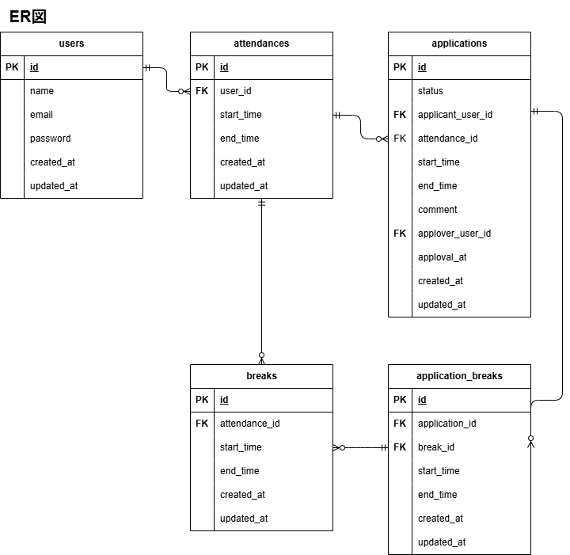

# アプリケーション名
chronoworks（勤怠管理アプリ）

## 概要
勤怠入力（開始・終了・休憩）、勤怠修正申請、承認などが行えます。  
ユーザーは一般と管理者に分かれています。

## 機能一覧
### 一般ユーザー
- 出退勤打刻（1日1回制御）
- 休憩開始・終了打刻（1日複数回可能）
- 勤怠修正申請（承認制）
- 申請ステータス確認
### 管理者
- 全ユーザー勤怠一覧表示
- 申請承認
- 勤怠直接修正

## 使用技術（実行環境）
- Laravel 10.50.0
- PHP 8.1.26-fpm
- mysql 8.0.36
- Docker / Docker Compose
- Nginx 1.24.0

## 画面遷移図
[こちらの画面遷移図（Figma）](https://www.figma.com/design/05TYNeIfupfwY0Hmuoivl0/%E6%A8%A1%E6%93%AC%E6%A1%88%E4%BB%B6_%E6%96%B0%E5%8B%A4%E6%80%A0%E7%AE%A1%E7%90%86%E3%82%A2%E3%83%97%E3%83%AA?node-id=0-1&p=f&t=cwxSIOLW7MRwmt52-0)をご参照ください。

## ルーティング一覧
### 一般ユーザー
|Method|URI|Route name|Controller|Summary|
|------|---|----------|----------|-------|
|GET|/attendance|attendance.index|AttendanceController@index|勤怠トップ|
|GET|/attendance/list|attendance.list|AttendanceController@list|勤怠一覧|
|GET|/attendance/detail/{attendance}|attendance.detail|AttendanceController@detail|勤怠詳細|
|POST|/attendance/start|attendance.start|AttendanceController@start|出勤打刻|
|POST|/attendance/end|attendance.end|AttendanceController@end|退勤打刻|
|POST|/break/start|break.start|BreakController@start|休憩開始|
|POST|/break/end|break.end|BreakController@end|休憩終了|
|GET|/stamp_correction_request/list|application.list|ApplicationController@list|修正申請一覧|
|GET|/stamp_correction_request/{application}|application.detail|ApplicationController@detail|修正申請詳細|
|POST|/stamp_correction_request|application.store|ApplicationController@store|修正申請作成|

### 管理者（Admin）
|Method|URI|Route name|Controller|Summary|
|------|---|----------|----------|-------|
|GET|/admin/login|admin.login|-|管理者ログイン画面|
|GET|/admin/attendance/list|admin.attendance.list|Admin\AttendanceController@list|勤怠一覧（日次）|
|GET|/admin/attendance/{attendance}|admin.attendance.detail|Admin\AttendanceController@detail|勤怠詳細|
|PUT|/admin/attendance/{attendance}|admin.attendance.update|Admin\AttendanceController@update|勤怠直接修正（更新）|
|GET|/admin/staff/list|admin.staff.list|Admin\AttendanceController@staffList|スタッフ一覧|
|GET|/admin/attendance/staff/{staff}|admin.attendance.staff|Admin\AttendanceController@staffAttendanceList|スタッフ別勤怠一覧|
|GET|/admin/attendance/staff/{staff}/csv|admin.attendance.staff.csv|Admin\AttendanceController@exportStaffMonthlyCsv|スタッフ別月次CSV出力|
|GET|/stamp_correction_request/approve/{application}|admin.application.detail|Admin\ApplicationController@detail|修正申請詳細（管理者）|
|POST|/stamp_correction_request/approve/{application}|admin.application.approve|Admin\ApplicationController@approve|修正申請承認|

> 管理者による申請承認は、仕様に合わせて  
/stamp_correction_request/approve/{application} を使用しています  。  
（adminプレフィックス未付与）


## ER図


## テーブル仕様書
[こちらのテーブル仕様書（Googleスプレッドシート）](https://docs.google.com/spreadsheets/d/1jExANbBU1Z2vNNaUE9iVfF8Fdn1iX-O7gIGHaa5i7qg/edit?gid=1188247583#gid=1188247583&range=A1)をご参照ください。
> applicationsのstatusはdefault値'pending'としました。  
（レコードinsert時点で申請が発生したとみなすため

## セットアップ手順
ご自身の作業ディレクトリに移動してから以下の手順で操作してください。

### 1. リポジトリをクローン
```bash
git clone https://github.com/nayu1011/chronoworks.git
cd chronoworks
```
＊MySQLが起動しない場合は、OSによりdocker-compose.ymlの設定を調整してください。

### 2. `.env`（UID/GID）を生成
Docker のコンテナ内ユーザーとWindowsファイル所有者を一致させるため、  
以下のコマンドを実行して .env を生成してください。

```bash
echo "UID=$(id -u)" > .env
echo "GID=$(id -g)" >> .env
```

### 3. Laravel アプリ用の `.env` を作成
```bash
cp src/.env.example src/.env  
```
src/.envを開いて、以下の通りに環境変数を変更してください。
```bash
DB_HOST=mysql
DB_DATABASE=laravel_db
DB_USERNAME=laravel_user
DB_PASSWORD=laravel_pass
```

### 4. PHP コンテナに入り Laravel をセットアップ
```bash
docker compose up -d --build
docker compose exec php bash
composer install
php artisan key:generate
```

### 5. ダミーデータ作成
環境によっては時間がかかる場合がありますが、下記コマンド実行後は完了までお待ちください。
```bash
php artisan migrate:fresh --seed
```

## ログイン情報
【一般ユーザー用】<a href="http://localhost/login" target="_blank">http://localhost/login</a>
```bash
一般ユーザー
email: user1@example.com（user1～user10）
password: password
```

【管理者用】<a href="http://localhost/admin/login" target="_blank">http://localhost/admin/login</a>
```bash
管理者
email: admin@example.com
password: password
```

## URL
- 開発環境：http://localhost/
- phpMyAdmin：http://localhost:8080/
- MailHog：http://localhost:8025/

## 操作手順概要
### 1.一般ユーザーでログイン
出勤　→　休憩入　→　休憩戻　→　退勤

### 2.修正申請
勤怠一覧の詳細から時刻変更　→　備考入力　→　申請

### 3.管理者でログイン
申請一覧の詳細から承認


## テスト
Featureテストのみ実装済み
```bash
php artisan optimize:clear
php artisan test
```

## Git 管理対象外について
以下をご参照ください
```bash
/.gitignore
/src/.gitignore
```

## 管理者による勤怠修正について

本システムでは、管理者は勤怠情報を直接修正可能としています。
この場合、修正内容は `attendances` および `breaks` テーブルに
直接反映され、申請履歴（applications）は作成されません。
なお、将来的な拡張として、以下の対応が考えられます。

- 管理者修正も `applications` テーブルに記録する
- `source_type` カラムを追加し、
  - `user_request`（ユーザー申請）
  - `admin_fix`（管理者直接修正）
  を区別することで証跡管理を強化する


以上
